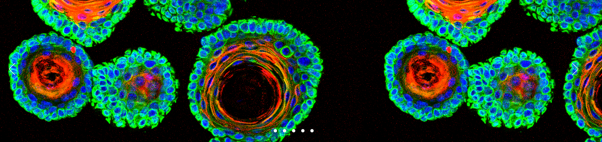

# Modelling Chlamydia and HPV co-infection in patient-derived ectocervix organoids reveals distinct cellular reprogramming

Coinfections with pathogenic microbes continually confront cervical mucosa, yet their implications in pathogenesis remain unclear. Lack of in-vitro models recapitulating cervical epithelium has been a bottleneck to study coinfections. Using patient-derived ectocervical organoids, we systematically modelled individual and coinfection dynamics of Human papillomavirus (HPV)16 E6E7 and Chlamydia, associated with carcinogenesis. The ectocervical stem cells were genetically manipulated to introduce E6E7 oncogenes to mimic HPV16 integration. Organoids from these stem cells develop the characteristics of precancerous lesions while retaining the self-renew capacity and organize into mature stratified epithelium similar to healthy organoids. HPV16 E6E7 interferes with Chlamydia development and induces persistence. Unique transcriptional and post-translational responses induced by Chlamydia and HPV lead to distinct reprogramming of host cell processes. Strikingly, Chlamydia impedes HPV-induced mechanisms that maintain cellular and genome integrity, including mismatch repair in the stem cells. Together, our study employing organoids demonstrate the hazard of multiple infections and the unique cellular microenvironment they create, potentially contributing to neoplastic progression.


#### For more information, please read our manuscript published in ***Nature Communication:***
	
	


	
	
*Stefanie Koster, Rajendra Kumar Gurumurthy, Naveen Kumar, Pon Ganish Prakash, Jayabhuvaneshwari Dhanraj, Sofia Bayer, Hilmar Berger, 
Shilpa Mary Kurian, Marina Drabkina, Hans-Joachim Mollenkopf, Christian Goosmann, Volker Brinkmann, Zachary Nagel, Mandy Mangler, 
Thomas F Meyer, Cindrilla Chumduri*. (https://doi.org/10.1038/s41467-022-28569-1)


## Overview
```
Folders:
└── Data: Pre-processed, Differential Exp., GSEA RData files are stashed here.
└── Code: Contains scripts for microarray analysis used in this manuscript.
        └──── Human Ectocervical Organoids
            │       	├── 00_Preprocessing_and_QC.Rmd
            │       	└── 01_Diff_Expression_analysis.Rmd
            │       	├── 02_Ctr_HPV_transcription_modules_v2.Rmd
            │       	└── 03_GSEA_Analysis.Rmd
            │       	├── 04_GSEA_plots.Rmd
            │       	└── 05_AdditionalVisualizations_2D.Rmd
            │       	├── 06_AdditionalVisualizations_3D.Rmd
            │       	└── 07_Helper_functions.R	    
            └─ Cervical Intra Epithelia Tissue
                    	└── 08_External_CIN_Analysis.R	
```


## Contact
*Please email the corresponding author in the main manuscript for other requests!*


## Research Group
[Chumduri Lab](https://www.chumdurilab.org/)
[](https://twitter.com/chumduri)



